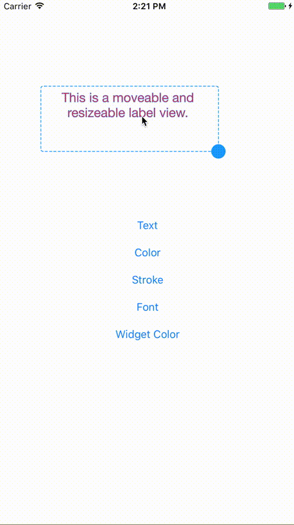

# MRLabel
## A user movable and resizable label view

### What It Does

### How to Install
Just add `MRLabel.swift` to your project.

### How to Use
1. Add a `UIView` to your scene
2. Go to the `Indentity Inspector` tab
3. In the Class field, type `MRLabel`

### Code Sample
    @IBOutlet weak var mrLabel: MRLabel!
    
    mrLabel.text = "The text was just changed"
    mrLabel.color = UIColor.white
    mrLabel.stroke = UIColor.black
    mrLabel.strokeWidth = 2
    mrLabel.font = UIFont(name: "GurmukhiMN-Bold", size: 18)!
    
    //widget color is the collor of the dashed border and the resize handle.
    mrLabel.widgetColor = UIColor(red: 0.8, green: 0, blue: 0, alpha: 1)
